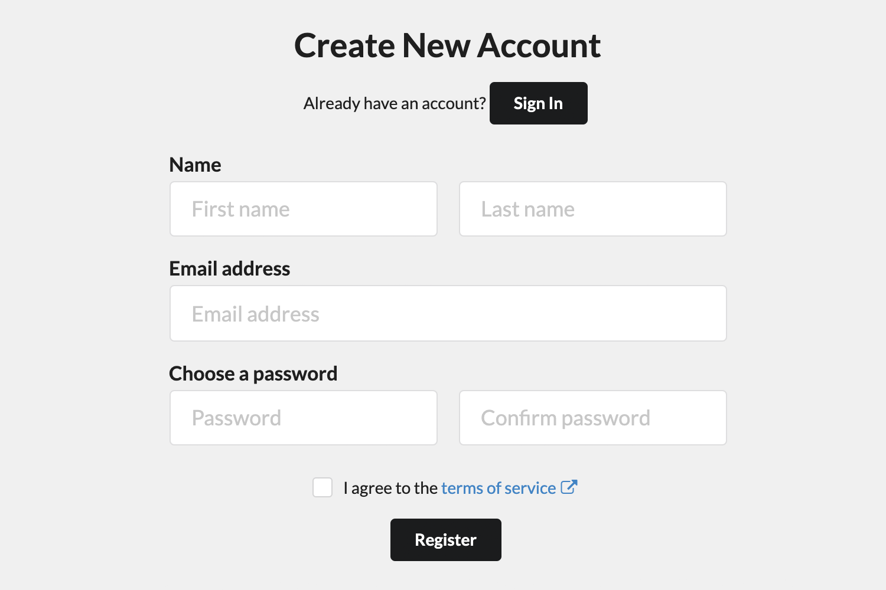
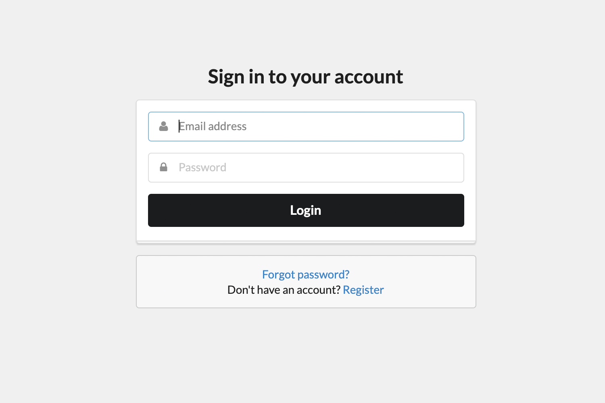
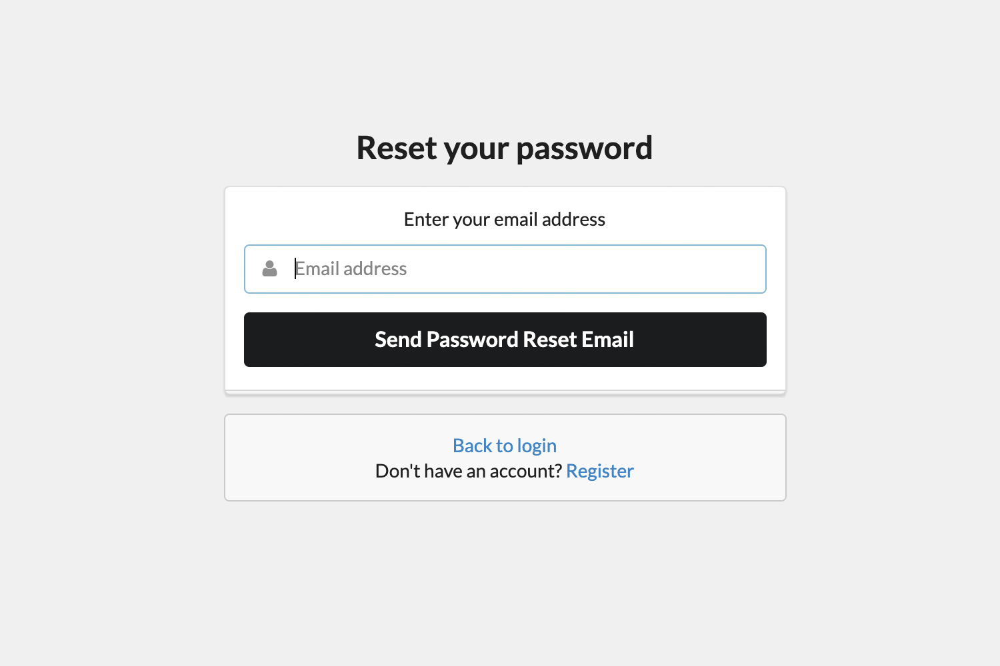
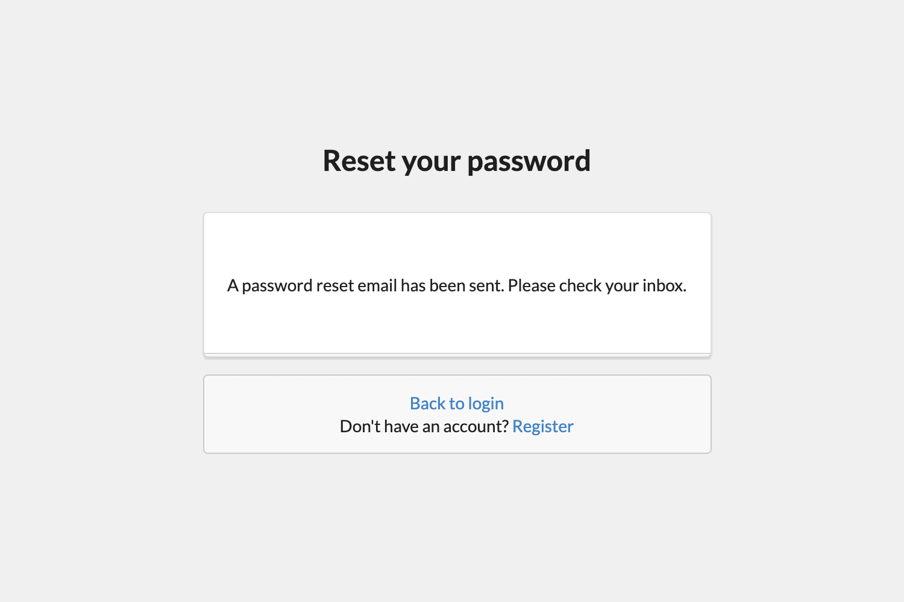
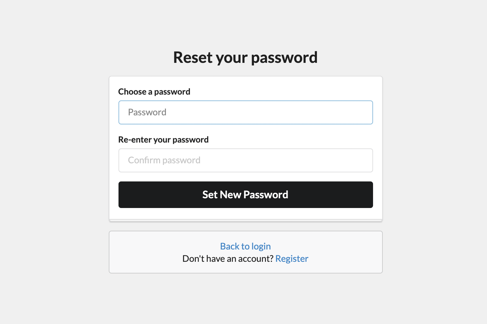

# express-user-auth

Quickly add user authentication to your Express app

- Works with any database
- Password hash stored using bcrypt
- Password reset functionality
- TODO: Login with Facebook, Twitter, Google, or Github

## Install 

```
npm i express express-user-auth
```

## Requirements

Your `createUser` and `updateUser` methods must be able to save the following fields: 
- `passwordHash`
- `passwordAlgo`
- `passwordResetToken`

## Usage

```js
import express from 'express'
import auth from 'express-user-auth'
 
const app = express()
 
// all functions are async and should return a Promise
app.use('/', auth({
  sessionSecret: 'XXXX',
  jwtSecret: 'XXXX',
  createUser: function (user) { return user },
  getUserByUsername: function (username) { return user },
  updateUser: function (data) { return user },
  sendPasswordReset: function ({ user, uri }) { },
  passwordResetRedirectURL: '/'
}))

app.listen(3000)
```

## Routes

`express-user-auth` creates the following routes:

- `GET /register`
- `GET /login`
- `GET /forgot-password`
- `GET /reset-password`

- `POST /register`
- `POST /login`
- `POST /send-password-reset`
- `POST /reset-password`

## Screenshots

You get this UI out of the box:


<hr />

<hr />

<hr />

<hr />



